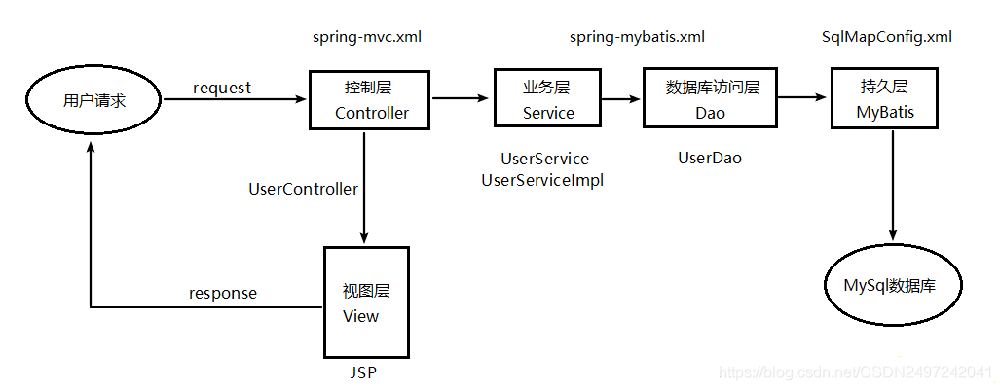
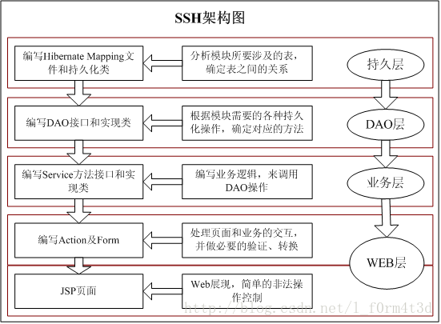

# JavaEE面经

## Spring 框架

### 特性

- **容器**：Spring 是一个容器，因为它包含并且管理应用对象的生命周期  
- **非侵入式**：基于Spring开发的应用中的对象可以不依赖于Spring的API  
- **控制反转**：IOC，指的是将对象的创建权交给 Spring 去创建。
  - **依赖注入**：DI，是指依赖的对象不需要手动调用 setXX 方法去设置，而是通过配置赋值。  
- **面向切面编程**：AOP，定义切面, 通过拦截切点实现了不同业务模块的解耦  
- **组件化**：Spring 实现了使用简单的组件配置组合成一个复杂的应用。在 Spring 中可以使用XML和Java注解组合这些对象。  
- **一站式**：在 IOC 和 AOP 的基础上可以整合各种企业应用的开源框架和优秀的第三方类库（实际上 Spring 自身也提供了表现层的 SpringMVC 和持久层的 Spring JDBC）

### Bean

> Spring Bean是一个由Spring IoC容器实例化、组装和管理的Java对象。默认单例模式。

**组件扫描**(component scanning)：Spring 会自动发现应用上下文中所创建的bean。  
**自动装配**(autowiring)：自动创建应用对象之间的协作关系。Spring自动满足bean之间的依赖。`@Autowired`实现对象的实例化，假如有且只有一个bean匹配依赖的话，那么这个bean将会被装配进来。  

### 什么是IOC? 如何实现的？

IOC（Inversion Of Controll，控制反转）是一种设计思想，就是将原本在程序中手动创建对象的控制权，交给IOC容器来管理（控制了外部资源获取），并由IOC容器完成对象的注入。这样可以很大程度上简化应用的开发，把应用从复杂的依赖关系中解放出来。IOC容器就像是一个工厂一样，当我们需要创建一个对象的时候，只需要配置好配置文件/注解即可，完全不用考虑对象是如何被创建出来的。
Spring 中的 IoC 的实现原理就是工厂模式加反射机制。

### 什么是AOP? 有哪些AOP的概念？

AOP（Aspect-Oriented Programming，面向切面编程）能够将那些与业务无关，却为业务模块所共同调用的逻辑或责任（例如事务处理、日志管理、权限控制等）封装起来，便于减少系统的重复代码，降低模块间的耦合度，并有利于未来的可扩展性和可维护性。
Spring AOP是基于动态代理的，如果要代理的对象实现了某个接口，那么Spring AOP就会使用JDK动态代理去创建代理对象；而对于没有实现接口的对象，就无法使用JDK动态代理，转而使用CGlib动态代理生成一个被代理对象的子类来作为代理。

### 七种事务传播行为

#### 1）Propagation.REQUIRED

如果当前存在事务，则加入该事务，如果当前不存在事务，则创建一个新的事务。

#### 2）Propagation.SUPPORTS

如果当前存在事务，则加入该事务；如果当前不存在事务，则以非事务的方式继续运行。

#### 3）Propagation.MANDATORY

如果当前存在事务，则加入该事务；如果当前不存在事务，则抛出异常。

#### 4）Propagation.REQUIRES_NEW

重新创建一个新的事务，如果当前存在事务，延缓当前的事务。

#### 5）Propagation.NOT_SUPPORTED

以非事务的方式运行，如果当前存在事务，暂停当前的事务。

#### 6）Propagation.NEVER

以非事务的方式运行，如果当前存在事务，则抛出异常。

#### 7）Propagation.NESTED

如果没有，就新建一个事务；如果有，就在当前事务中嵌套其他事务。

### Spring boot与Spring

Spring Boot基本上是Spring框架的扩展，它消除了设置Spring应用程序所需的复杂例行配置。为更快，更高效的开发生态系统铺平了道路。以下是Spring Boot中的一些功能：

- 通过starter这一个依赖，以简化构建和复杂的应用程序配置。
- 可以直接main函数启动，嵌入式web服务器，避免了应用程序部署的复杂性，Metrics度量，Helth check健康检查和外部化配置。
- 尽可能的自动化配置Spring功能。

### Spring事务管理和mysql事务

**Spring事务管理的五大属性**：隔离级别、是否只读、事务超时、传播行为、回滚规则。
其中隔离级别、是否只读、事务超时 这三个特性都是基于数据库支持来实现的。

- Spring 提供了传播行为的功能。
- Spring 提供了基于异常的事务回滚的功能。

### Spring boot与SpringMVC

1. springMVC是Spring的一个模式，是一个Web框架，提供了一个轻度耦合的方式来开发Web应用；
2. SpringBoot是习惯优于配置，降低了项目搭建的难度；
3. springMVC需要使用到TomCat服务器，SpringBoot的话是内嵌了Tomcat服务器的；

### Spring boot与Spring Cloud

Spring Cloud是一整套基于Spring Boot的微服务解决方案。它为开发者提供了很多工具，用于快速构建分布式系统的一些通用模式，例如：配置管理、注册中心、服务发现、限流、网关、链路追踪等。

## SSM框架

SSM框架即指Spring+SpringMVC+MyBatis的简称，框架集由Spring、MyBatis两个开源框架整合而成（SpringMVC是Spring中的部分内容）。
将整个系统划分为表现层，controller层，service层，DAO层四层

使用spring MVC负责请求的转发和视图管理，spring实现业务对象管理，mybatis作为数据对象的持久化引擎

## SSH框架

SSH就是 struts+spring+hibernate 的一个集成框架，是java中一种流行的JAVA WEB 应用程序开源框架。

Struts 是一个很好的MVC框架，主要技术是Servlet 和Jsp.Struts的MVC设计模式，可以让程序变得层次分明。
Spring提供了管理业务对象的一致化方法，并且鼓励对**接口编程**而不是对类编程，这样在很大程度上松解了耦合。
Hibernate 是用来持久化数据的，提供全面的面向对象的数据库操作，Hibernate 对JDBC进行了非常**轻量级的封装**，这样和数据库打交道就容易多了。

- **Struts负责的是web层**：
ActionFormBean接收网页中表单提交的数据，然后通过Action进行处理，再Forward到对应的网页中，在Struts-config.xml中定义action-mapping,这样ActionServlet会加载进来。
- **Spring负责的是业务逻辑层（Service）**：
Service为Action提供统一的调用接口，封装持久层的DAO，并且集成了Hibernate ,Spring可对JavaBean（对象）和事物进行统一的管理。
- **Hibernate负责持久层，完成数据库的CRUD操作**：
Hibernate有一组hbm.xml和PO，是数据库中的对应的表相对应的，然后定义DAO，这些是与数据库打交道的类。
