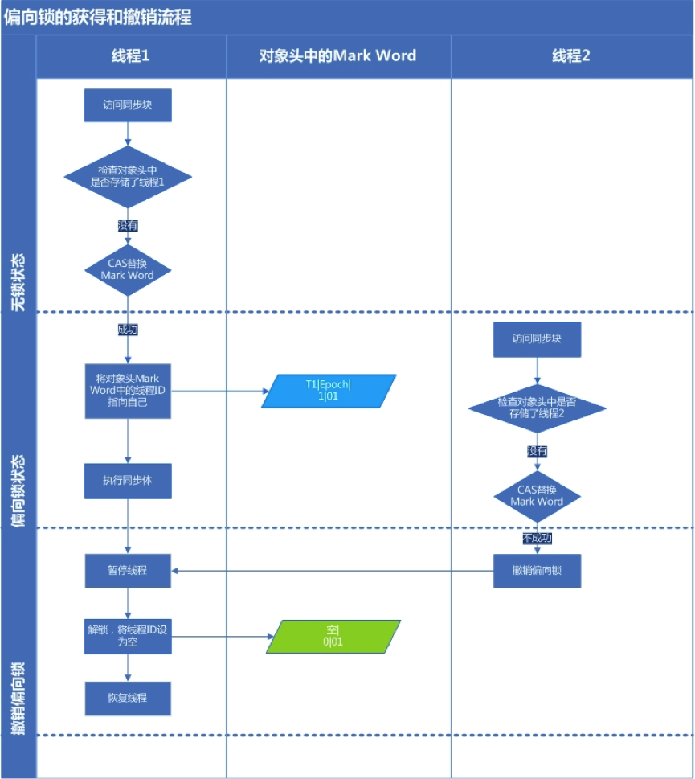

# JavaSE面经

## 并发锁🔒

### synchronized的锁同步

同步是对同一把锁而言的，同步这个概念是在多个线程争夺**同一把锁**的时候才能实现的，如果多个线程争夺**不同的锁**，那多个线程是不能同步的

- 两个线程一个取**对象锁**，一个取**类锁**，则不能同步
- 两个线程一个取**a**对象锁，一个取**b**对象锁，则不能同步

**类锁**：使持有者可以同步地调用静态方法。当synchronized指定修饰静态方法或者class对象的时候，拿到的就是类锁，类锁是所有对象共同争抢一把。
用法：`synchronized (A.class)` `synchronized  static void B()`

**对象锁**：synchronized修饰非静态方法或者this的时候拿到的就是对象锁，对象锁是每个对象各有一把
用法：`synchronized (this)` `synchronized void B()`

### 悲观锁

假设最坏的情况，每次去拿数据的时候都认为别人会修改，所以每次在拿数据的时候都会上锁。**共享资源每次只给一个线程使用，其它线程阻塞**，用完后再把资源转让给其它线程。
传统的关系型数据库里边就用到了很多这种锁机制，比如行锁，表锁等，读锁，写锁等，都是在做操作之前先上锁。Java中`synchronized`和`ReentrantLock`等独占锁就是悲观锁思想的实现

### 乐观锁

假设最好的情况，每次去拿数据的时候都认为别人不会修改，所以不会上锁。乐观锁**适用于多读的应用类型，这样可以提高吞吐量**。
数据库提供的类似于write_condition机制，其实都是提供的乐观锁。在Java中`java.util.concurrent.atomic`包下面的原子变量类就是使用了乐观锁的一种实现方式**CAS**实现的。

### 锁粗化

将多次连接在一起的加锁、解锁操作合并为一次，将多个连续的锁扩展成一个范围更大的锁。

### 自旋锁

- 当前线程尝试去竞争锁
- 竞争失败，准备阻塞自己
- 但是并没有阻塞自己，而是采用自旋锁，进入自旋状态，并且重新不断竞争锁
- 如果在自旋期间成功获取锁，那么结束自旋状态，少一次线程的切换，否则进入阻塞状态

因为cpu从内核态切换至用户态，线程的阻塞与恢复会浪费资源，但是通过自旋而不是去阻塞当前线程，那么就会节省一个cpu状态切换。自旋锁适合在**持有锁的时间长，且竞争不激烈**的场景下使用。

### 偏向锁

- 访问同步代码块
- 检查对象头是否owner是否存储当前现成的id
- 如果没有，进行CAS尝试替换mark word中的owner 如果有执行同步代码（代表获取锁- 成功）
- 修改成功 （代表无竞争）owner修改为当前线程id，执行同步代码 修改失败(代表有竞争) 进入撤销偏向锁，暂停线程并将owner置空，进入轻量锁。

偏向锁假定将来**只有第一个申请锁的线程会使用锁**（不会有任何线程再来申请锁），因此，只需要在Mark Word中CAS记录owner（本质上也是更新，但初始值为空），如果记录成功，则偏向锁获取成功，记录锁状态为偏向锁，以后当前线程等于owner就可以零成本的直接获得锁；否则，说明有其他线程竞争，**膨胀为轻量级锁**。

- 偏向锁适用于**没有多线程竞争**的场景。
- 偏向锁无法使用自旋锁优化，因为一旦有其他线程申请锁，就破坏了偏向锁的假定。

### 轻量锁

偏向锁是为了解决同步代码在单线程下访问性能问题，那么轻量锁是为了**减少无实际竞争情况下，使用重量级锁产生的性能消耗**

使用轻量锁时，**不需要申请互斥量**(mutex)，而是将mark word中的信息复制到当前线程的栈中，然后通过cas尝试修改mark word并替换成轻量锁，如果替换成功则执行同步代码。如果此时有线程2来竞争，并且他也尝试CAS修改mark word但是失败了，那么线程2会进入**自旋状态**，如果在自旋状态也没有修改成功，那么轻量锁将膨胀成重量锁状态，mark word会被修改成重量锁标记(10) ,线程进入阻塞状态

### 重量锁

`synchronized`是基于**监视器锁**(monitor)来实现的，它会在同步代码之前添加一个`monitorenter`指令，获取到该对象的monitor，同时它会在同步代码结束处和异常处添加一个`monitorexit`指令去释放该对象的monitor,需要注意的是每一个对象都有一个monitor与之配对，当一个monitor被获取之后 也就是被monitorenter，它会处于一个**锁定状态**，其他尝试获取该对象的monitor的线程会获取失败，只有当获取该对象的monitor的线程执行了monitorexit指令后，其他线程才有可能获取该对象的monitor成功。

### 比较

- 偏向锁：无实际竞争，且将来只有第一个申请锁的线程会使用锁。
- 轻量级锁：无实际竞争，多个线程交替使用锁；允许短时间的锁竞争。
- 重量级锁：有实际竞争，且锁竞争时间长。
- **锁可以升级，但是不能降级**。

## JMM（Java memory model）

JMM实现了**原子性，可见性，有序性**，用于屏蔽掉各种硬件和操作系统的内存访问差异，以实现让Java程序在各种平台下都能达到一致的并发效果。

### 主内存与工作内存

所有的变量都存储在主内存中，每个线程还有自己的工作内存，工作内存存储在高速缓存或者寄存器中，保存了该线程使用的变量的主内存副本拷贝。

线程只能直接操作工作内存中的变量，不同线程之间的变量值传递需要通过主内存来完成。

### 八种内存交互操作

- **lock**(锁定)，作用于**主内存**中的变量，把变量标识为线程独占的状态。
- **read**(读取)，作用于**主内存**的变量，把变量的值从主内存传输到线程的工作内存中，以便下一步的load操作使用。
- **load**(加载)，作用于**工作内存**的变量，把read操作主存的变量放入到工作内存的变量副本中。
- **use**(使用)，作用于**工作内存**的变量，把工作内存中的变量传输到执行引擎，每当虚拟机遇到一个需要使用到变量的值的字节码指令时将会执行这个操作。
- **assign**(赋值)，作用于**工作内存**的变量，它把一个从执行引擎中接受到的值- 赋值给工作内存的变量副本中，每当虚拟机遇到一个给变量赋值的字节码指令时将会执行这个操作。
- **store**(存储)，作用于**工作内存**的变量，它把一个从工作内存中一个变量的值传送到主内存中，以便后续的write使用。
- **write**(写入)：作用于**主内存**中的变量，它把store操作从工作内存中得到的变量的值放入主内存的变量中。
- **unlock**(解锁)：作用于**主内存**的变量，它把一个处于锁定状态的变量释放出来，释放后的变量才可以被其他线程锁定。

#### 操作规则

- 如果要把一个变量从主内存中复制到工作内存，就需要按顺寻地执行read和load操作， 如果把变量从工作内存中同步回主内存中，就要按顺序地执行store和write操作。但Java内存模型只要求上述操作必须按顺序执行，而没有保证必须是连续执行。
- 不允许read和load、store和write操作之一单独出现
- 不允许一个线程丢弃它的最近assign的操作，即变量在工作内存中改变了之后必须同步到主内存中。
- 不允许一个线程无原因地（没有发生过任何assign操作）把数据从工作内存同步回主内存中。
- 一个新的变量只能在主内存中诞生，不允许在工作内存中直接使用一个未被初始化（load或assign）的变量。即就是对一个变量实施use和store操作之前，必须先执行过了assign和load操作。
- 一个变量在同一时刻只允许一条线程对其进行lock操作，但lock操作可以被同一条线程重复执行多次，多次执行lock后，只有执行相同次数的unlock操作，变量才会被解锁。lock和unlock必须成对出现
- 如果对一个变量执行lock操作，将会清空工作内存中此变量的值，在执行引擎使用这个变量前需要重新执行load或assign操作初始化变量的值
- 如果一个变量事先没有被lock操作锁定，则不允许对它执行unlock操作；也不允许去unlock一个被其他线程锁定的变量。
- 对一个变量执行unlock操作之前，必须先把此变量同步到主内存中（执行store和write操作）

### volatile

- 保证线程间变量的可见性。
- 禁止CPU进行指令重排序。

#### 原理

- 规定线程每次修改变量副本后立刻同步到主内存中，用于保证其它线程可以看到自己对变量的修改
- 规定线程每次使用变量前，先从主内存中刷新最新的值到工作内存，用于保证能看见其它线程对变量修改的最新值
- 为了实现可见性内存语义，编译器在生成字节码时，会在指令序列中插入**内存屏障**来防止指令重排序。

## 反射

### 使用场景

在编译时无法知道该对象或类可能属于哪些类，程序在运行时获取对象和类的信息

### 作用

通过反射可以使程序代码访问装载到 JVM 中的类的内部信息，获取已装载类的属性信息、方法信息

### 优点

- 提高了 Java 程序的灵活性和扩展性，降低耦合性，提高自适应能力。
- 允许程序创建和控制任何类的对象，无需提前硬编码目标类
- 应用很广，测试工具、框架都用到了反射

### 缺点

- 性能问题：反射是一种解释操作，远慢于直接代码。因此反射机制主要用在对灵活性和扩展性要求很高的系统框架上,普通程序不建议使用
- 模糊程序内部逻辑：反射绕过了源代码，无法再源代码中看到程序的逻辑，会带来维护问题
- 增大了复杂性：反射代码比同等功能的直接代码更复杂

## 进程与线程

### 如何实现线程安全

#### 不可变

不可变（Immutable）的对象一定是线程安全的，不需要再采取任何的线程安全保障措施。
不可变的类型：final 关键字修饰的基本数据类型、String、枚举类型、Number 部分子类。

#### 互斥同步

同步是指在多线程并发访问共享数据时，**保证共享数据在同一时刻只被一个线程使用**（同一时刻，只有一个线程在操作共享数据）。而互斥是实现同步的一种手段，临界区、互斥量和信号量都是主要的互斥实现方式。互斥是方法，同步是目的。
synchronized 和 ReentrantLock通过互斥实现同步。
互斥同步最主要的问题就是进行线程阻塞和唤醒所带来的性能问题，因此这种同步也成为阻塞同步。

#### 非阻塞同步

##### CAS

compare and swap（比较与交换）无锁算法，不使用锁的情况下实现多线程之间的变量同步，也就是在没有线程被阻塞的情况下实现变量的同步，所以也叫**非阻塞同步**（Non-blocking Synchronization）
CAS存在ABA问题，即无法识别是否已经修改，栈顶问题会出现隐患。

##### 版本号机制

在数据表中加上一个数据版本号version字段，表示数据被修改的次数，当数据被修改时，version值会加一。

#### 无同步方案

如果一个方法本来就**不涉及共享数据**，那它自然就无需任何同步操作去保证正确性

##### 可重入代码

可重入代码（ReentrantCode）也称为纯代码（Pure Code），可以在代码执行的任何时刻**中断**它，转而去执行另外一段代码，而在控制权返回后，原来的程序不会出现任何错误。所有的可重入代码都是线程安全的，但是并非所有的线程安全的代码都是可重入的。
可重入代码的特点是**不依赖存储在堆上的数据和公用的系统资源**、用到的状态量都是由参数中传入、不调用 非可重入的方法等。

##### 线程本地存储

### ThreadPoolExecutor 常用方法

- `submit()/execute()`：执行线程池
- `shutdown()/shutdownNow()`：终止线程池
- `isShutdown()`：判断线程是否终止
- `getActiveCount()`：正在运行的线程数
- `getCorePoolSize()`：获取核心线程数
- `getMaximumPoolSize()`：获取最大线程数
- `getQueue()`：获取线程池中的任务队列
- `allowCoreThreadTimeOut(boolean)`：设置空闲时是否回收核心线程

### submit() 和 execute() 区别

`submit()` 和 `execute()` 都是用来执行线程池的，不过使用 `execute()` 执行线程池不能有返回方法，而使用 `submit()` 可以使用 Future 接收线程池执行的返回值。

### shutdownNow() 和 shutdown() 区别

`shutdownNow()` 和 `shutdown()` 都是用来终止线程池的。

- 使用 `shutdown()` 程序不会报错，也不会立即终止线程，它会等待线程池中的缓存任务执行完之后再退出，执行了 `shutdown()` 之后就不能给线程池添加新任务了；
- `shutdownNow()` 会试图立马停止任务，如果线程池中还有缓存任务正在执行，则会抛出 `java.lang.InterruptedException: sleep interrupted` 异常。
