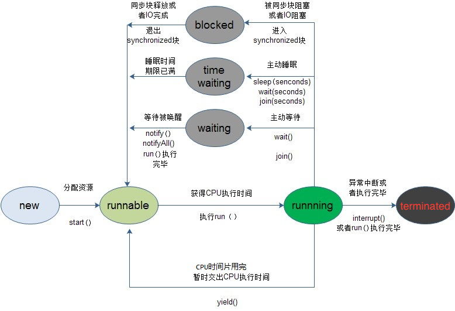
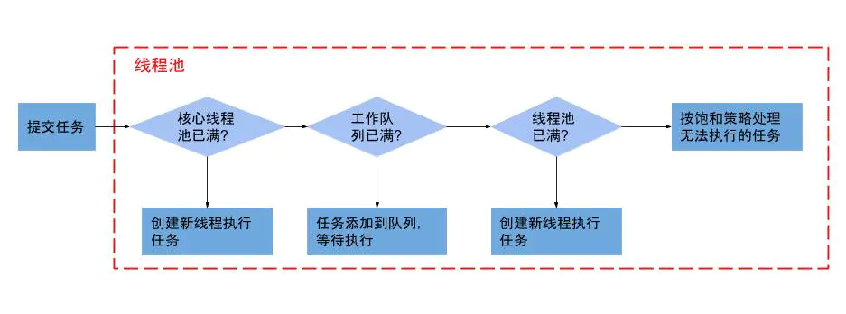

# 操作系统

## PCB（进程控制块）

**PCB主要包含下面几部分的内容**：

- 进程的描述信息，比如进程的名称，标识符，
- 处理机的状态信息，当程序中断是保留此时的信息，以便 CPU 返回时能从断点执行
- 进程调度信息，比如阻塞原因，状态，优先级等等
- 进程控制和资源占用，同步通信机制，链接指针（指向队列中下一个进程的 PCB 地址）

**PCB 的作用**：

- PCB是进程实体的一部分，是操作系统中最重要的数据结构
- 由于它的存在，使得多道程序环境下，不能独立运行的程序成为一个能独立运行的基本单位，使得程序可以并发执行
- 系统通过 PCB 来感知进程的存在。（换句话说，PCB 是进程存在的唯一标识）

## 死锁

### 死锁发生的条件

- **互斥条件**：是资源分配是互斥的，资源要么处于被分配给一个进程的状态，要么就是可用状态。
- **等待和占有条件**：进程在请求资源得不到满足的时候，进入阻塞等待状态，且不释放已占有的资源。
- **不剥夺条件**：已经分配给一个进程的资源不能强制性地被抢占，只能等待占有他的进程释放。
- **环路等待**：有两个或者两个以上的进程组成一条环路，该环路中的每个进程都在等待下一个进程释放所占有的资源。

### 死锁的处理方法

- **鸵鸟策略**：假装根本没发生问题。
- **死锁检测与死锁恢复**：不试图阻止死锁，而是当检测到死锁发生时，采取措施进行恢复。
- **死锁预防**：在程序**运行之前**预防发生死锁。
- **死锁避免**：在程序**运行时**避免发生死锁。（银行家算法）

### 死锁恢复

- 利用抢占恢复
- 利用回滚恢复
- 通过杀死进程恢复

### 死锁预防

1. 破坏互斥条件
例如假脱机打印机技术允许若干个进程同时输出，唯一真正请求物理打印机的进程是打印机守护进程。
2. 破坏占有和等待条件
一种实现方式是规定所有进程在开始执行前请求所需要的全部资源。
3. 破坏不可抢占条件
4. 破坏环路等待
给资源统一编号，进程只能按编号顺序来请求资源。

## 进程与线程

### 进程与线程的区别

1. 进程是**资源分配**（CPU时间、内存）的最小单位，线程是**程序执行**的最小单位。（资源调度的最小单位）
2. 进程拥有**独立的堆栈空间和数据段**，每启动一个进程，系统就会为它分配独立的地址空间，建立数据表来维护代码段、堆栈段和数据段，系统开销比较大。由于进程之间独立的特点，使得**进程安全性比较高**。
3. 线程虽然拥有独立的堆栈空间，但是共享进程中的数据，使用相同的地址空间，因此CPU切换一个线程的**花费远比进程要小很多**，同时创建一个线程的开销也比进程要小很多。线程**不能够独立执行**，必须依存在应用程序中。
4. 线程之间的**通信更方便**，**同一进程下的线程共享全局变量、静态变量等数据**，而进程之间的通信需要以通信的方式（IPC)进行。
5. 但是多进程程序更健壮，多线程程序只要有一个线程死掉，整个进程也死掉了，而一个进程死掉并不会对另外一个进程造成影响，因为进程有自己独立的地址空间。

### 进程与线程的关系

- 一个线程只能属于一个进程，而一个进程可以有多个线程，但**至少有一个线程**。线程是操作系统可识别的最小执行和调度单位。
- 资源分配给进程，同一进程的所有线程共享该进程的所有资源。 同一进程中的**多个线程共享代码段(代码和常量)，数据段(全局变量和静态变量)，扩展段(堆存储)**。但是每个线程拥有自己的栈段，栈段又叫运行时段，用来存放所有**局部变量和临时变量**。
  - JAVA 每个线程有自己的程序计数器、虚拟机栈和本地方法栈
  - 程序计数器私有主要是为了线程切换后能恢复到正确的执行位置
  - 虚拟机栈和本地方法栈私有是为了保证线程中的局部变量不被别的线程访问
- 处理机分给线程，即真正在处理机上运行的是线程。
- 线程在执行过程中，需要协作同步。不同进程的线程间要利用**消息通信实现同步**。

### 使用情景

- 需要频繁**创建销毁**的优先使用线程；因为对进程来说创建和销毁一个进程代价是很大的
- 线程的切换速度快，所以在需要大量计算，**切换频繁**时用线程，还有耗时的操作使用线程可提高应用程序的响应
- 因为对CPU系统的效率使用上线程更占优，所以可能要发展到多机分布的用进程，多核分布用线程
- **异步处理、并行操作**时使用线程，如C/S架构的服务器端并发线程响应用户的请求
- 需要更稳定安全时，适合选择进程；需要速度时，选择线程更好

### 线程开销

分配内存、列入调度，同时在线程切换的时候执行内存换页，CPU的缓存被清空，切换回来时重新从内存中读取信息

### 线程池

- 线程：核心线程和工作线程。
- 阻塞队列：用于待执行任务排队。
- 被拒绝时的处理器。

当提交一个新任务到线程池时，线程池的处理流程如下：

- 首先线程池判断基本线程池是否已满？没满，创建一个工作线程来执行任务。满了，则进入下个流程。
- 其次线程池判断工作队列是否已满？没满，则将新提交的任务存储在工作队列里。满了，则进入下个流程。
- 最后线程池判断整个线程池是否已满？没满，则创建一个新的工作线程来执行任务，满了，则交给饱和策略来处理这个任务。

PS:线程池运行过程中，当线程数量与核心数量一致时。并不是当任务来了就直接创建一个新的线程去执行，而是先放到缓冲队列中，队列满的时候才会去判断最大线程数，从而决定是执行拒绝策略还是创建新的线程。

#### 为什么用线程池

- 降低资源消耗。通过重复利用已创建的线程降低线程创建和销毁造成的消耗。
- 提高响应速度。任务可以不需要等到线程创建就能立即执行。
- 提高系统资源可管理性，使用线程池统一分配、管理和监控。

#### 线程池状态

**RUNNING**：能接受新提交的任务，并且也能处理阻塞队列中的任务；
**SHUTDOWN**：待关闭状态，不再接受新提交的任务，但可以继续处理阻塞队列中已接收的任务。
**STOP**：不能接受新任务，也不处理队列中的任务，放弃缓存队列中的任务并中断正在处理任务的线程。
**TIDYING**：线程池自主整理状态，调用 terminated() 方法进行线程池整理。
**TERMINATED**：线程池终止状态。在terminated() 方法执行完后进入该状态。

#### 线程复用原理

线程池将**线程和任务进行解耦**，摆脱了之前通过 Thread 创建线程时的一个线程必须对应一个任务的限制。
在线程池中，同一个线程可以从阻塞队列中不断获取新任务来执行，其核心原理在于线程池对 Thread 进行了封装，并不是每次执行任务都会调用 `Thread.start()` 来创建新线程，而是让每个线程去执行一个“**循环任务**”，在这个“循环任务”中不停的检查是否有任务需要被执行，如果有则直接执行（调用任务中的 run 方法），使用固定的线程就能将所有任务的 run 方法串联起来。

## 进程同步

### 同步与互斥

- **线程同步**，直接制约关系，是指多个线程（或进程）为了合作完成任务，必须严格按照规定的某种先后次序来运行。
- **线程互斥**：间接制约关系，是指系统中的某些共享资源，一次只允许一个线程访问。当一个线程正在访问该临界资源时，其它线程必须等待。
- 互斥是指某一资源同时只允许一个访问者对其进行访问，具有**唯一性和排它性**。但互斥无法限制访问者对资源的访问顺序，即访问是无序的。
- 同步是指在互斥的基础上（大多数情况），通过其它机制实现访问者对资源的**有序访问**。
- 同步其实已经实现了互斥，所以同步是一种更为复杂的互斥。互斥是一种特殊的同步。

### 临界区（Critical Section）

通过对多线程的串行化来访问公共资源或一段代码，速度快，适合控制数据访问。保证在某一时刻只有一个线程能访问数据。

缺点：虽然临界区同步速度很快，但却**只能同步本进程内的线程**，而不可同步多个进程中的线程。

### 互斥量（Mutex）

为协调共同对一个共享资源的单独访问而设计的。不仅可以在同一应用程序的不同线程中实现资源的安全共享，还可以在**不同的进程间实现同步**，从而实现资源的安全共享。

### 信号量（Semaphore）

与临界区和互斥量不同，可以实现**多个线程同时访问公共区域数据**，原理与操作系统中PV操作类似，先设置一个访问公共区域的线程最大连接数，每有一个线程访问共享区资源数就减一，直到资源数小于等于零。信号量机制必须有公共内存，**不能用于分布式操作系统**。

### 事件（Event）

用来通知线程有一些事件已发生（**线程触发事件**），从而启动后继任务的开始。事件对象通过通知操作的方式来保持线程的同步，并且可以实现不同进程中的线程同步操作。

## IPC（进程间通信）

### 管道（pipe）

管道是一种半双工的通信方式，数据只能单向流动，而且只能在具有亲缘关系的进程间使用。进程的亲缘关系通常是指父子进程关系。

### 命名管道（FIFO）

有名管道也是半双工的通信方式，但是它允许无亲缘关系进程间的通信。

### 信号量（semophore）

信号量是一个计数器，可以用来控制多个进程对共享资源的访问。不是用于交换大批数据,而用于多线程之间的同步.常作为一种锁机制,防止某进程在访问资源时其它进程也访问该资源。因此，主要作为进程间以及同一进程内不同线程之间的同步手段。

### 消息队列（message queue）

消息队列是由消息的链表，存放在内核中并由消息队列标识符标识。消息队列克服了信号传递信息少、管道只能承载无格式字节流以及缓冲区大小受限等缺点。

### 信号（signal）

信号是一种比较复杂的通信方式，用于通知接收进程某个事件已经发生。

### 共享内存（shared memory）

共享内存就是映射一段能被其他进程所访问的内存，这段共享内存由一个进程创建，但多个进程都可以访问。共享内存是最快的 IPC 方式，它是针对其他进程间通信方式运行效率低而专门设计的。它往往与其他通信机制，如信号两，配合使用，来实现进程间的同步和通信。

### 套接字（socket）

套解口也是一种进程间通信机制，与其他通信机制不同的是，它可用于不同机器间的进程通信。

## 虚拟内存

### 虚拟内存概念

- 传统的内存管理必须把作业一次性的 load 到内存中，并且一直驻留到其作业运行结束，当作业很大时，是没有办法一次性装入内存的。
- 在一段时间内，只需要访问小部分数据就可以保证程序的正常运行。所以基于局部性原理，在程序加载的时候，把很快就会用到的部分放入内存中，暂时用不到的部分留在磁盘上。在程序执行的过程中，当信息不在内存时，再从外存把信息加载到内存里。当内存不够的时候，根据一些策略把用不到的内存换出到外存中，从而腾出空间给要调入内存的信息。而在 os 的管理下，让应用程序认为自己拥有一连续可用的内存，产生独享主存的错觉，这就是虚拟内存。

### 虚拟内存实现技术

- 请求分页式存储管理
建立在分页管理的基础之上，为了支持虚拟内存实现了请求调页和页面置换功能。具体流程：
  - 作业运行时，仅装入当前要执行的部分页面。
  - 假如在运行过程中，发现要请求的页面不在内存中，处理器通知操作系统按照对应的页面置换算法把相应的页面调入到内存中。
  - 如果发现在把页面调入内存时，内存已满，同时也可以把不用的页面置换出去，以便腾出空间装入新的页面。
- 请求分段式存储管理（同分页）
- 请求段页式存储管理

## IO多路复用

- select，poll是基于轮询实现的，将fd_set从用户空间复制到内核空间，然后让内核空间以poll机制来进行轮询，一旦有其中一个fd对应的设备活跃了，那么就把整个fd_set返回给客户端（复制到用户空间），再由客户端来轮询每个fd的，找出发生了IO事件的fd
- epoll是基于事件驱动实现的，加入一个新的fd，会调用epoll_ctr函数为该fd注册一个回调函数，然后将该fd结点注册到内核中的epoll红黑树中，当IO事件发生时，就会调用回调函数，将该fd结点放到就绪链表中，epoll_wait函数实际上就是从这个就绪链表中获取这些fd。
- epoll分为EPOLLLT（水平触发，默认状态）和EPOLLET（边缘触发，效率高）
