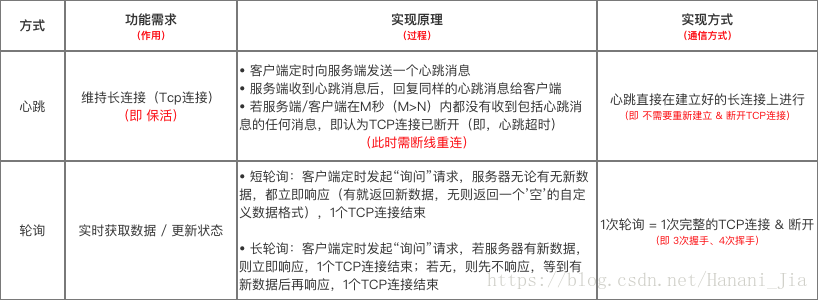
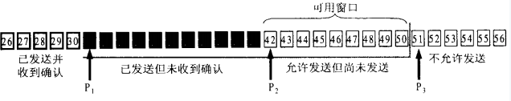

# 计算机网络

## 应用层

### HTTPS与HTTP

- HTTPS协议需要到ca申请证书
- HTTP是超文本传输协议，信息是明文传输，HTTPS协议是由SSL+HTTP协议构建的可进行加密传输、身份认证的网络协议，比http协议安全。
- HTTP和HTTPS使用的是完全不同的连接方式，用的端口也不一样，前者是80，后者是443。
- HTTPS可以有效的防止运营商劫持，解决了防劫持的一个大问题。

### http1.0 与 http1.1

- **长连接**："Connection:keep-alive"，HTTP 1.1支持**长连接**（PersistentConnection）和**请求的流水线**（Pipelining）处理，在一个TCP连接上可以传送多个HTTP请求和响应，减少了建立和关闭连接的消耗和延迟。（存在队头阻塞）
  - 实现方法：进程保活、**心跳保活机制**、断线重连机制。
- **带宽优化**：HTTP/1.1 中在请求消息中引入了 **range 头域**，它允许只请求资源的某个部分，减少了带宽浪费。
- HTTP/1.1 增加了 **OPTIONS 方法**，它允许客户端获取一个服务器支持的方法列表。
- **Host头处理**：在HTTP1.0中请求消息中的URL并**没有传递主机名**（hostname）。但在一台物理服务器上可以存在多个虚拟主机（Multi-homed Web Servers），并且它们共享一个IP地址。HTTP1.1的请求消息和响应消息都应支持Host头域，且请求消息中如果**没有Host头域会报告一个错误**（400 Bad Request）。
- **缓存处理**：在HTTP1.0中主要使用header里的If-Modified-Since，Expires来做为缓存判断的标准，HTTP1.1则引入了更多的缓存控制策略例如Entity tag，If-Unmodified-Since, If-Match, If-None-Match等更多可供选择的缓存头来控制缓存策略。
- **错误通知的管理**：HTTP/1.0 中只定义了 16 个状态响应码，对错误或警告的提示不够具体。HTTP/1.1 引入了一个**Warning 头域**，增加对错误或警告信息的描述。此外，在 HTTP/1.1 中新增了 24 个状态响应码。

### http2 与 http1.1

- **二进制格式**：HTTP/2 采用二进制格式而非文本格式。实现方便且健壮。
- **多路复用**：连接共享，每一个request都是用作连接共享机制的。HTTP/2 是完全多路复用的，而非有序并阻塞的——只需一个连接即可实现并行。
  - 多路复用通过多个请求stream共享一个tcp连接的方式，解决了HOL blocking的问题，降低了延迟同时提高了带宽的利用率。
- **header压缩**：HTTP/2 使用encoder来减少需要传输的header大小，通讯双方各自cache一份header fields表，既避免了重复header的传输，又减小了需要传输的大小。
- **服务端推送**：HTTP/2 让服务器可以将响应主动 “推送” 到客户端缓存中，而不是等待适当的客户端请求。

### 心跳机制与轮询

客户端会定期向服务器发送一个心跳包（自定义结构体），服务器收到心跳包之后，回复同样的心跳包，完成一次握手操作，保持TCP的长链接状态。如果隔了一定时间后服务器和客户端都没有收到心跳包或者其他类型的消息，则TCP断开链接。

- 轮询是为了获取数据，而心跳TCP是为了保证链接状态。
- 频繁数据获取时轮询更加及时，但心跳机制是否频繁和数据获取没有关系。
- 轮询消耗非常高，因为一次轮询需要经过三次TCP握手，四次挥手；但心跳机制不需要建立或者断开TCP链接。

### Get与POST的区别

- 从功能上讲，GET一般用来从服务器上获取资源，POST一般用来更新服务器上的资源；
- 从REST服务角度上说，GET是幂等的，即读取同一个资源，总是得到相同的数据，而POST不是幂等的，因为每次请求对资源的改变并不是相同的；进一步地，GET不会改变服务器上的资源，而POST会对服务器资源进行改变；
- 从请求参数形式上看，GET请求的数据会附在URL之后，即将请求数据放置在HTTP报文的 请求头 中，以?分割URL和传输数据，参数之间以&相连。特别地，如果数据是英文字母/数字，原样发送；否则，会将其编码为字符串。而POST请求会把提交的数据则放置在是HTTP请求报文的 请求体 中。
- 就安全性而言，POST的安全性要比GET的安全性高，因为GET请求提交的数据将明文出现在URL上，而且POST请求参数则被包装到请求体中，相对更安全。
- 从请求的大小看，GET请求的长度受限于浏览器或服务器对URL长度的限制，允许发送的数据量比较小，而POST请求则是没有大小限制的。

### 文件传输协议

FTP 使用 TCP 进行连接，它需要两个连接来传送一个文件：

- **控制连接**：服务器打开端口号 21 等待客户端的连接，客户端主动建立连接后，使用这个连接将客户端的命令传送给服务器，并传回服务器的应答。
- **数据连接**：用来传送一个文件数据。

根据数据连接是否是服务器端主动建立，FTP 有主动和被动两种模式。

### 动态主机配置协议

DHCP (Dynamic Host Configuration Protocol) 配置了 IP 地址、子网掩码、网关 IP 地址等，提供了即插即用的连网方式，用户不再需要手动配置 IP 地址等信息。
工作方式：

1. 客户端发送 Discover 报文，该报文的目的地址为 255.255.255.255:67，源地址为 0.0.0.0:68，被放入 UDP 中，该报文被广播到同一个子网的所有主机上。如果客户端和 DHCP 服务器不在同一个子网，就需要使用中继代理。
2. DHCP 服务器收到 Discover 报文之后，发送 Offer 报文给客户端，该报文包含了客户端所需要的信息。因为客户端可能收到多个 DHCP 服务器提供的信息，因此客户端需要进行选择。
3. 如果客户端选择了某个 DHCP 服务器提供的信息，那么就发送 Request 报文给该 DHCP 服务器。
4. DHCP 服务器发送 Ack 报文，表示客户端此时可以使用提供给它的信息。

### 电子邮件协议

一个电子邮件系统由三部分组成：用户代理、邮件服务器以及邮件协议。邮件协议包含发送协议和读取协议，发送协议常用 SMTP，读取协议常用 POP3 和 IMAP。

### Web 页面请求过程

1. DHCP 配置主机信息
2. ARP 解析 MAC 地址
3. DNS 解析域名
4. HTTP 请求页面

## 传输层

### UDP 和 TCP 的特点

- 用户数据报协议 UDP（User Datagram Protocol）是无连接的，尽最大可能交付，没有拥塞控制，面向报文（对于应用程序传下来的报文不合并也不拆分，只是添加 UDP 首部），支持一对一、一对多、多对一和多对多的交互通信。首部开销小，只有8个字节。
- 传输控制协议 TCP（Transmission Control Protocol）是面向连接的，提供可靠交付，有流量控制，拥塞控制，提供全双工通信，面向字节流（把应用层传下来的报文看成字节流，把字节流组织成大小不等的数据块），每一条 TCP 连接只能是点对点的（一对一）。首部20个字节。

### TCP可靠性传输保证

#### 检验和

计算时要加上12byte的伪首部，检验范围包括TCP首部及数据部分，但是UDP的检验和字段为可选的，而TCP中是必须有的。计算方法为：在发送方将整个报文段分为多个16位的段，然后将所有段进行反码相加，将结果存放在检验和字段中，接收方用相同的方法进行计算，如最终结果为检验字段所有位是全1则正确（UDP中也是全为1则正确），否则存在错误。

#### 序列号/确认应答

序列号：TCP将每个数据包都进行的编号，作用：保证可靠性、数据的按序到达，去除重复数据  
只要发送端有一个包传输，接收端没有回应确认包（ACK包），都会重发。或者接收端的应答包，发送端没有收到也会重发数据。这就可以保证数据的完整性。

#### 超时重传

当报文发出后在一定的时间内未收到接收方的确认，发送方就会进行重传

#### 连接管理

TCP建立连接时的三次握手和断开连接时的四次挥手。

#### 流量控制

**根据接收端的处理能力，来决定发送端的发送速度**，当接收方来不及处理发送方的数据，能提示发送方降低发送的速率，防止包丢失。  
> TCP报文段首部中有一个16位窗口长度，当接收端接收到发送方的数据后，在应答报文ACK中就将自身缓冲区的剩余大小，放入16窗口大小中。这个大小随数据传输情况而变,一旦接收方发现自身的缓冲区快满了，就将窗口设置为更小的值通知发送方。如果缓冲区满，就将窗口置为0，发送方收到后就不再发送数据，但是需要定期发送一个窗口探测数据段，使接收端把窗口大小告诉发送端。

#### 滑动窗口

窗口的大小就是在无需等待确认包的情况下，发送端还能发送的最大数据量。窗口的实现是操作系统开辟的一个缓冲区，发送方在等待确认应答报文返回之前，必须在缓冲区中保留已发送的数据。如果在规定时间间隔内收到确认应答报文，可以判断接收端已经接收到了数据，就可以将数据从缓冲区中清除。

##### 累计确认：一个确认包确认了累积到某一序号的所有包，而不是对每个序号都发确认包

### 拥塞控制

#### 慢启动

连接建好的开始先初始化 $cwnd = 1$，表明可以传一个MSS大小的数据。
每当收到一个ACK， $cwnd++$; 呈线性上升
每当过了一个RTT，$cwnd = cwnd\times2$; 呈指数让升
ssthresh（slow start threshold），当cwnd >= ssthresh时，就会进入“拥塞避免状态”

#### 拥塞避免

收到一个ACK时，$cwnd = (cwnd + 1)\div cwnd$
当每过一个RTT时，$cwnd = cwnd + 1$

#### 快重传

收到3个重复的确认就立刻重传，不等到超时。
$cwnd = cwnd \div 2$
$sshthresh = cwnd$，进入快速恢复算法

#### 快恢复

$cwnd = sshthresh + 3 \times MSS$ （收到3个重复的ACK）重传Duplicated ACKs指定的数据包
如果再收到 duplicated Acks，那么 $cwnd = cwnd +1$
如果收到了新的Ack，那么 $cwnd = sshthresh$ ，然后进入拥塞避免状态。

## 网络层

### 地址解析协议 ARP（Address Resolution Protocol）

通信过程中，IP 数据报的源地址和目的地址始终不变，而 MAC 地址随着链路的改变而改变。ARP 实现由 IP 地址得到 MAC 地址。（ARP 高速缓存、广播发送 ARP 请求分组）

### 网际控制报文协议 ICMP（Internet Control Message Protocol）

ICMP 是为了更有效地转发 IP 数据报和提高交付成功的机会。它封装在 IP 数据报中，但是不属于高层协议。ICMP 报文分为差错报告报文和询问报文。

- Ping 是 ICMP 的一个重要应用，主要用来测试两台主机之间的连通性。
Ping 的原理是通过向目的主机发送 ICMP Echo 请求报文，目的主机收到之后会发送 Echo 回答报文。Ping 会根据时间和成功响应的次数估算出数据包往返时间以及丢包率。
- Traceroute 是 ICMP 的另一个应用，用来跟踪一个分组从源点到终点的路径。
Traceroute 发送的 IP 数据报封装的是无法交付的 UDP 用户数据报，并由目的主机发送终点不可达差错报告报文。

### 网络地址转换 NAT

专用网内部的主机使用本地 IP 地址又想和互联网上的主机通信时，可以使用 NAT 来将本地 IP 转换为全球 IP。

### 路由器结构

路由器从功能上可以划分为：路由选择和分组转发。
分组转发结构由三个部分组成：交换结构、一组输入端口和一组输出端口。

### 路由选择协议

互联网可以划分为许多较小的自治系统 AS，一个 AS 可以使用一种和别的 AS 不同的路由选择协议。

#### 内部网关协议 IGP

**自治系统内部**的路由选择，在一个域中选择路由。

#### 外部网关协议 EGP

一种为两个相邻的位于各自域边界上的路由器提供交换消息和信息的方法。
BGP是常用的外部网关协议，是**不同自治系统之间**路由器交换路由信息的协议。

### RIP协议（路由信息协议）

一种分布式的、基于距离向量的IGP协议。RIP是**距离向量路由协议**。要求自治系统内的每一个路由器都要维护从它自己到其他每一个目的网络的距离向量。

### OSPF（开放最短路径优先协议）

OSPF使用Dijkstra最短路径算法，是IGP协议。OSPF用于单一系统内决策路由。与RIP相比，OSPF是**链路状态路由协议**。
OSPF通过路由器之间通告网络接口的状态来建立链路状态数据库，生成最短路径树，每个OSPF路由器使用这些最短路径构造路由。
